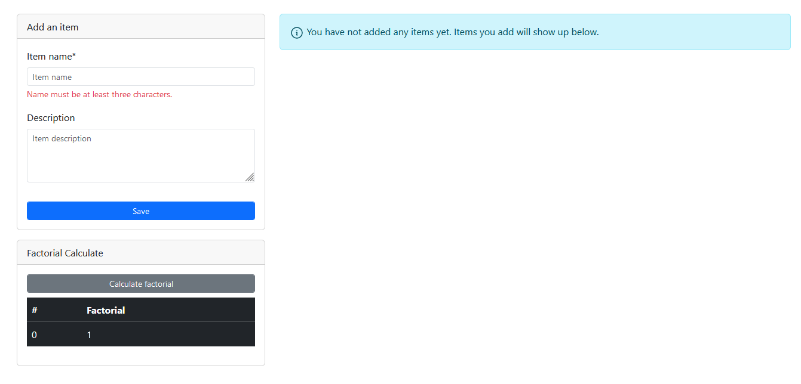
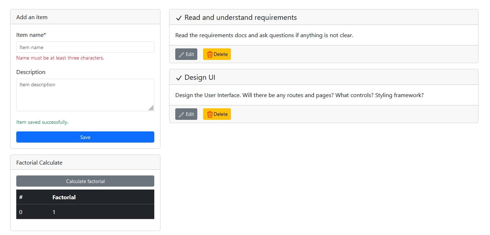
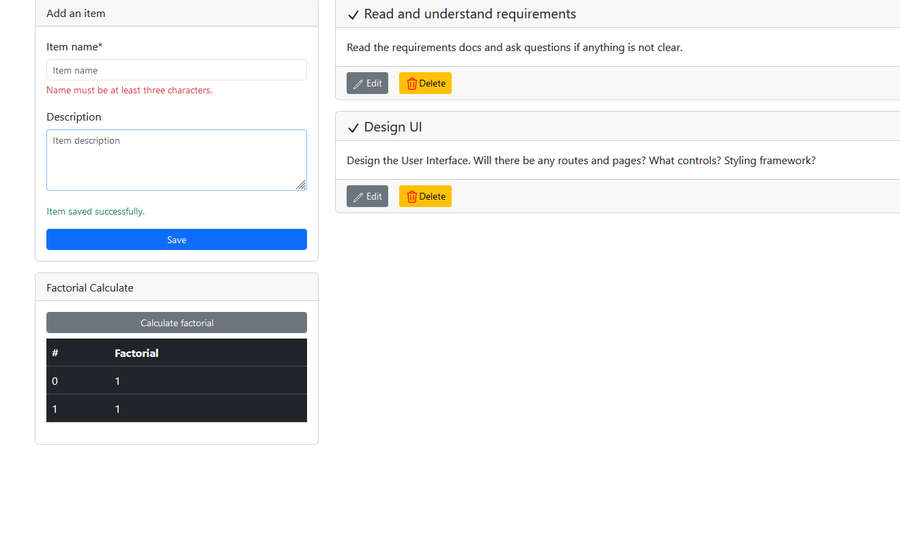

# ItemsStoreUi

This project was generated with [Angular CLI](https://github.com/angular/angular-cli) version 17.1.2.

## Local development setup

1. Run `npm ci` to install the node modules without altering `package-lock.json`.
This is the recommended approach. 
If the above does not work, run `npm i` to install all packages. Note that 
this may modify `package-lock.json`  

2. Run the API as documented [here](https://github.com/mustafa-mohamed-k/items-store-api#local-development). 
Note down the port that used as we will be using it elsewhere in a moment.  

3. Open [proxy.conf.js](proxy.conf.js) and edit the port number on line 5 to 
match the port number you used in step 2 above. (If you ran the API from Visual Studio, 
you will probably not have to change the port number.)  

4. Run `ng serve` for a dev server. Navigate to `http://localhost:4200/` to see
the application in action.😎

## Screenshots

## Development server

Run `ng serve` for a dev server. Navigate to `http://localhost:4200/`. The application will automatically reload if you change any of the source files.

## Code scaffolding

Run `ng generate component component-name` to generate a new component. You can also use `ng generate directive|pipe|service|class|guard|interface|enum|module`.

## Build

Run `ng build` to build the project. The build artifacts will be stored in the `dist/` directory.

## Running unit tests

Run `ng test` to execute the unit tests via [Karma](https://karma-runner.github.io).

## Running end-to-end tests

Run `ng e2e` to execute the end-to-end tests via a platform of your choice. To use this command, you need to first add a package that implements end-to-end testing capabilities.

## Further help

To get more help on the Angular CLI use `ng help` or go check out the [Angular CLI Overview and Command Reference](https://angular.io/cli) page.
